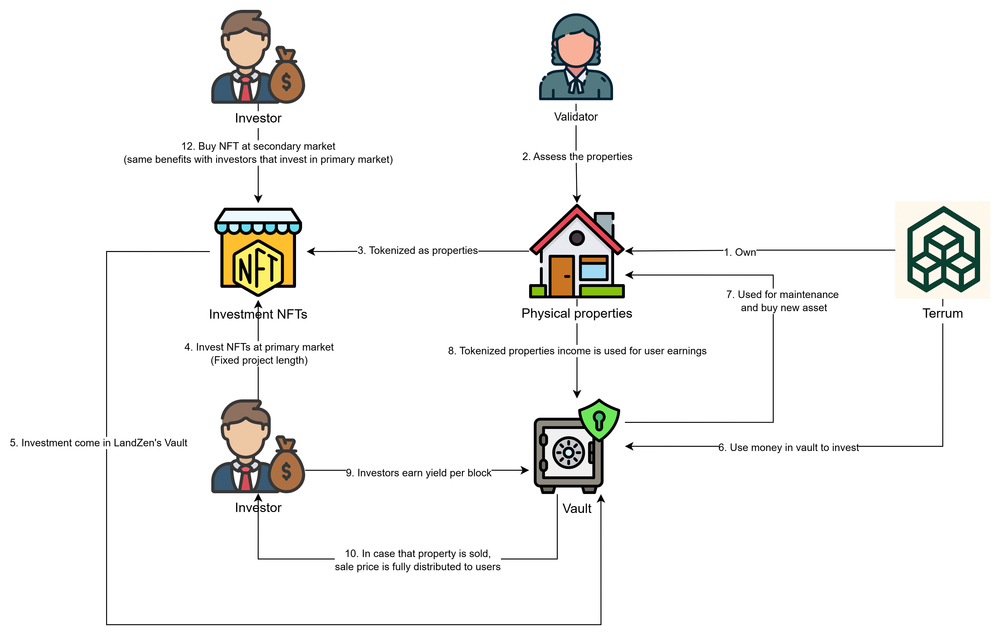

# Terrum 🏡

<div align="center">
    
</div>

<h3 align="center">Unlocking Real Estate Investment for All</h3>

**Terrum is a revolutionary real estate tokenization platform that transforms how people invest in Vietnamese property markets.** By fractionalizing premium real estate assets into NFTs, we make high-value property investment accessible to everyone. Each property is tokenized into tradeable shares, allowing investors to own fractions of luxury real estate and earn rental yields automatically through smart contracts.

We bridge the gap between traditional real estate investment and decentralized finance, offering property ownership, yield generation, and liquid trading – all powered by blockchain technology on the U2U network.

## ✨ Core Benefits

Terrum creates a revolutionary ecosystem where real estate meets DeFi:

### For Individual Investors 💰

*   **Fractional Ownership:** Start investing in premium Vietnamese real estate with as little as $120 per NFT share.
*   **Automatic Yield Generation:** Earn monthly rental income (averaging $2.11 per NFT) distributed automatically via smart contracts.
*   **Liquid Real Estate Investment:** Buy and sell property shares instantly on our decentralized marketplace – no lengthy traditional real estate transactions.
*   **Diversified Portfolio:** Own fractions of multiple properties across Vietnam from Saigon Pearl to Sapa Highland Retreats.
*   *(Example: Buy 10 NFT shares of Da Nang Marina Bay for $1,200, earn ~$21/month in rental yield, and sell anytime on the marketplace!)*

### For Property Developers & Owners 🏗️

*   **Instant Capital Access:** Tokenize properties to raise capital immediately instead of waiting for traditional buyers.
*   **Global Investor Pool:** Access international investors who can buy fractional shares, expanding your buyer base exponentially.
*   **Automated Management:** Smart contracts handle rent distribution, reducing administrative overhead.
*   **Maintained Control:** Retain operational control while unlocking liquidity through tokenization.

### For DeFi Enthusiasts 📊

*   **Real-World Asset Exposure:** Diversify your crypto portfolio with tokenized real estate backed by physical assets.
*   **Yield Beyond Staking:** Earn rental income from real properties instead of just token emissions.
*   **NFT Marketplace Trading:** List, buy, and cancel property NFTs with full decentralized trading capabilities.
*   **On-Chain Transparency:** All property performance, yields, and transactions are publicly verifiable on blockchain.

### For Vietnam's Real Estate Future 🚀

*   **Financial Inclusion:** Enables anyone to invest in premium real estate previously accessible only to wealthy individuals.
*   **Market Liquidity:** Transforms illiquid real estate into tradeable digital assets, increasing market efficiency.
*   **Cross-Border Investment:** Allows global investors to participate in Vietnam's growing property market seamlessly.
*   **Innovation Foundation:** Sets the groundwork for advanced real estate DeFi products like lending against property NFTs.

### For the U2U Ecosystem 🌐

*   **Liquidity Expansion:** Real estate tokenization converts illiquid property markets into liquid, tradable assets on U2U, driving transaction volume and utility across DeFi protocols.
*   **Network Adoption:** Terrum onboards property developers, investors, and institutions to U2U, increasing daily active users and demonstrating real-world blockchain use cases.
*   **DePIN Leadership:** Showcases U2U's Decentralized Physical Infrastructure capabilities by tokenizing and trading physical real estate assets at scale.
*   **Enterprise Foundation:** Establishes precedent for enterprise-grade RWA applications, fueling advanced financial primitives on U2U's modular architecture.

## Why U2U Network?

Terrum is built natively on U2U's advanced blockchain infrastructure, leveraging its unique advantages for real estate tokenization:

**DAG-Based Scalability:** U2U's Directed Acyclic Graph architecture enables fast, low-cost transactions essential for frequent property trading and yield distributions.

**EVM Compatibility:** Full Ethereum compatibility allows seamless integration with existing DeFi tools while enabling cross-chain asset flows and interoperability with other U2U dApps.

**Subnet Architecture:** U2U's modular subnet system enables custom governance structures and specialized yield mechanisms for different property types and investment strategies.

**DePIN Focus:** Aligns perfectly with U2U's Decentralized Physical Infrastructure vision, demonstrating how blockchain can tokenize and trade real-world physical assets at enterprise scale.

**Enterprise Ready:** High throughput, fast finality, and institutional-grade security make U2U ideal for bringing traditional real estate markets on-chain while maintaining Vietnamese market focus.

<div align="center">
    
</div>

## 🛠️ Technical Architecture

*   **Core Infrastructure:**
    *   **Property NFTs**: ERC-721 tokens representing fractional ownership of real estate assets
    *   **USDT (Mock)**: Stablecoin for property transactions and yield distribution 
    *   **Land Tokenizer**: Factory contract for deploying and managing property tokenization
    *   **Decentralized Marketplace**: Peer-to-peer trading of property NFT shares

*   **Key Smart Contract Components:**
    *   **Land Contract**: Individual property smart contract managing NFT minting, yield distribution, and ownership tracking
    *   **Marketplace Contract**: Handles listing, purchasing, and canceling of NFT trades with 2.5% platform fee
    *   **Tokenizer Factory**: Deploys new property contracts with standardized yield mechanisms
    *   **Yield Distribution System**: Automated monthly rental income distribution to NFT holders based on ownership percentage

*   **Blockchain Infrastructure:**
    *   **Network**: U2U Testnet (Chain ID: 2484) - Vietnamese blockchain network
    *   **Block Time**: ~12 seconds, enabling precise yield distribution timing  
    *   **Yield Calculation**: Monthly earnings distributed based on 216,000 blocks (30 days) cycles
    *   **Property Deployment**: Staggered launches with 1000-block intervals for orderly market entry

*   **Frontend Architecture:** 
    *   **Next.js 15** with TypeScript for type-safe development
    *   **Real-time Updates**: 10-second refresh intervals for live marketplace and portfolio data
    *   **Wallet Integration**: Multi-wallet support (MetaMask, OKX, Rabby) via wagmi
    *   **Toast Notifications**: Smooth UX with professional feedback instead of browser alerts

### Tech Stack

<div align="center">  
     <br>
     <br>
</div>

### Core Technologies

- **Git & GitHub**: For version control and collaboration, enabling seamless code management and team workflows.
- **VSCode**: A versatile code editor with extensive extensions, used for writing, debugging, and deploying code across various projects.
- **Figma**: A collaborative design tool for creating high-fidelity UI/UX designs, wireframes, and prototypes for web and mobile applications.
- **React**: A powerful JavaScript library for building dynamic and responsive user interfaces in web applications.
- **Next.js**: A React framework that enables server-side rendering and static site generation for fast and SEO-friendly web applications.
- **Tailwind CSS**: A utility-first CSS framework for designing modern and responsive user interfaces with ease.
- **TypeScript**: A strongly-typed programming language that builds on JavaScript, providing better tooling and maintainability for large-scale projects.

### Blockchain & Web3 Technologies

- **Solidity**: Smart contract development for property tokenization, marketplace logic, and yield distribution mechanisms.
- **Foundry**: Development framework for testing, deploying, and managing real estate smart contracts on U2U network.
- **U2U Network**: Vietnamese blockchain network providing fast, cost-effective transactions for property trading.
- **ERC-721 NFTs**: Property share representation enabling fractional ownership and secondary market trading.

### Infrastructure

- **Frontend Deployment**: Vercel for hosting the real estate platform interface.
- **Smart Contracts Deployment**: U2U testnet for property tokenization and marketplace operations.
- **Testing Framework**: Forge (Foundry) for comprehensive property contract testing and yield mechanism validation.

### Tools

- **Package Manager**: pnpm for efficient dependency management.
- **Linting**: ESLint for maintaining code quality and consistency.
- **Formatting**: Prettier for automatic code formatting.

## 🔥 Features

*   ✅ **Property Investment:** Purchase fractional NFT shares of premium Vietnamese real estate starting from $120.
*   ✅ **Automated Yields:** Earn monthly rental income (~$2.11/NFT) distributed automatically via smart contracts.
*   ✅ **NFT Marketplace:** List, buy, and trade property shares instantly with decentralized P2P trading.
*   ✅ **Portfolio Dashboard:** Track holdings, monitor yields, and manage your real estate investment portfolio.
*   ✅ **Multi-Wallet Support:** Connect with MetaMask, OKX, Rabby, and other popular Web3 wallets.
*   ✅ **Real-time Data:** Live updates on property performance, marketplace activity, and yield distributions.
*   ✅ **Vietnam-Focused:** Exclusively featuring premium Vietnamese properties from Saigon to Sapa.
*   ✅ **Toast Notifications:** Smooth, professional user experience with elegant feedback systems.
*   ✅ **Mobile Responsive:** Full functionality across desktop and mobile devices.
*   ✅ **Type-Safe Development:** Built with TypeScript for reliability and maintainability.

## 📜 Contract Addresses

Here are the core contract addresses deployed on the **U2U Testnet (Chain ID: 2484)**:

| **Contract**                | **Address**                                   |
|-----------------------------|-----------------------------------------------|
| Mock USDT                   | `0x5Df5E5FD5396e1387A982a7A7450D0c7CEaB40B8` |
| Land Tokenizer Factory      | `0x5A6C7b515328E1598d3F1B62E2404f8B525D4E86` |
| Marketplace Contract        | `0x51163fF3ac2A2F10a25DFb226FCF2AD5D4ab4e95` |

**Network Details:**
- **Chain ID:** 2484
- **RPC URL:** `https://rpc-nebulas-testnet.uniultra.xyz`
- **Block Explorer:** U2U Nebulas Testnet Explorer

*Individual property contracts are deployed dynamically through the Land Tokenizer Factory with 1000-block intervals for staggered launches.*

## 🚀 Local Development Setup

To run Terrum locally, follow these steps:

1. **Clone the Repository:**
   ```bash
   git clone https://github.com/Hirosolo/Terrum.git
   cd Terrum
   ```

2. **Install Dependencies:**
   Ensure you have `pnpm` installed. Then, run:
   ```bash
   pnpm install
   ```

3. **Set Up Environment Variables:**
   Create a `.env.local` file in the root directory:
   ```bash
   # Add your environment variables here
   NEXT_PUBLIC_WALLETCONNECT_PROJECT_ID=your_project_id
   ```

4. **Compile Smart Contracts:**
   Navigate to the foundry directory and compile contracts:
   ```bash
   cd foundry
   forge build
   ```

5. **Run Contract Tests:**
   Execute the test suite to ensure everything works:
   ```bash
   forge test
   ```

6. **Start the Frontend:**
   Return to root directory and start the development server:
   ```bash
   cd ..
   pnpm dev
   ```

7. **Access the Platform:**
   Open your browser and navigate to `http://localhost:3000`

8. **Connect to U2U Testnet:**
   Add U2U testnet to your wallet:
   - **Network Name:** U2U Testnet
   - **RPC URL:** `https://rpc-nebulas-testnet.uniultra.xyz`
   - **Chain ID:** 2484
   - **Currency Symbol:** U2U

---

<div align="center">
    <strong>🏡 Own Vietnam's Future, One NFT at a Time 🇻🇳</strong>
</div>